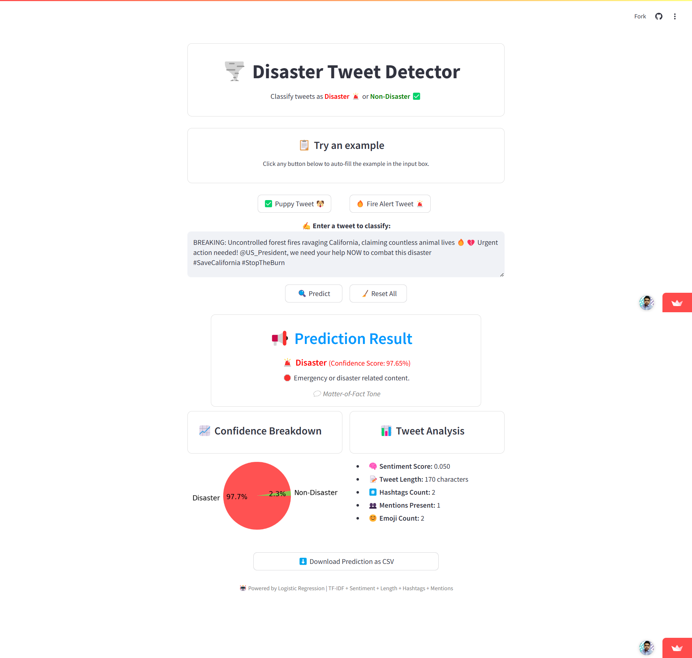

# 🌍 Disaster Tweet Classification (NLP Project)

This project is about classifying tweets to check whether they are related to a real disaster or not using NLP techniques. It covers everything from text cleaning, feature extraction, model building, and finally deployment.

🚀 **Live App**: [https://disaster-tweet-nlp-debasis-baidya.streamlit.app](https://disaster-tweet-nlp-debasis-baidya.streamlit.app)

---

## 📌 Problem Statement

Sometimes people tweet about disasters, and sometimes they just use words like “fire” or “storm” in a casual way. The goal here is to build a model that can tell whether a tweet is actually referring to a real disaster or not.

---

## 🧠 What’s Inside

- Cleaned the tweets by removing links, mentions, hashtags, special characters, etc.
- Used **TF-IDF** for feature extraction
- Combined it with features like sentiment score, tweet length, hashtag/mention count
- Tried out models like **Logistic Regression**, **Random Forest**, etc.
- Built a simple but interactive **Streamlit app** to make predictions easily

---

## 🖥️ Streamlit App Features

- 🔍 Type or paste any tweet and get a real-time prediction
- 📋 Try out predefined examples with one click
- 📈 View confidence score in a pie chart
- 📊 Analyze the tweet: sentiment, length, emoji count, etc.
- ⬇️ Download prediction as a CSV file
- 🧠 All backed by Logistic Regression with TF-IDF + extra features

---

## 🧪 Example

If you enter a tweet like: "BREAKING: Uncontrolled forest fires ravaging California, claiming lives 🔥💔"

The model will predict:  
**🚨 Disaster** (with a confidence score)

---

## 🔍 How the App Works (Behind the Scenes)

1. **Text Preprocessing**:
   - Removes noise like URLs, numbers, mentions, etc.
   - Tokenizes and lemmatizes the tweet
   - Filters stopwords

2. **Feature Extraction**:
   - TF-IDF vector
   - Sentiment polarity using TextBlob
   - Tweet length, hashtag count, mention presence

3. **Model Prediction**:
   - Logistic Regression model trained on the cleaned dataset
   - Probability scores returned and interpreted live

4. **Interactive UI**:
   - Everything handled using Streamlit with instant feedback
   - Pie chart for confidence
   - Tweet-level breakdown and downloadable result

---

## 📸 App Preview

> Screenshot of Hosted Streamlit Dashboard.

---

## 📁 Project Files

- `Disaster Tweet Classifier.ipynb`: The main notebook with code and models
- `tweet.py`: Streamlit app logic
- `requirements.txt`: List of packages used for Streamlit
- `vectorizer.pkl` & `Logistic_Regression.pkl`: Model + vectorizer files

---

## 🙋‍♂️ About Me

This was a NLP project I worked on to understand how to handle text data and build something useful out of it. Always open to feedback or improvements.  
**– Debasis Baidya**

